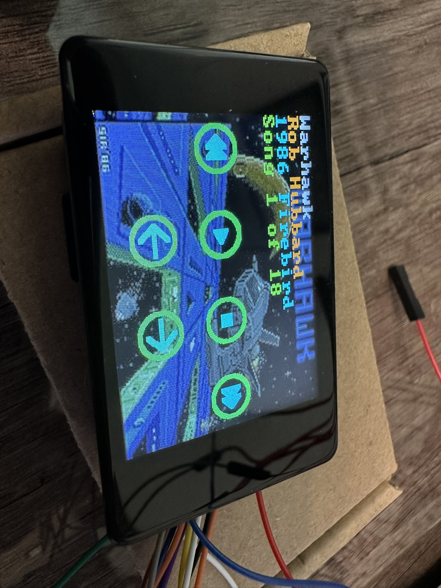

# 🎵 Raspberry Pi Pico SID Tune Player Display 
A multi‑Pico hardware project for playing Commodore 64 SID tunes from an SD card.

This system uses **three Raspberry Pi Pico boards** working together to deliver authentic SID playback, touchscreen controls, and visual artwork.

---

## License
This project is licensed under the [MIT License](LICENSE).

---

## 🧩 System Overview

This project consists of:

### **1. Player Pico 2 (RP2350) [SID Display Github Repo](https://github.com/Kokovec/SID_Player_Dan)**
- Reads `.sid` files from a micro SD card  
- Handles tune playback logic  
- Sends SID register writes to the SIDKick‑Pico board  

### **2. Display Pico (RP2040)**
- Drives a **2” 240×320 IPS capacitive touchscreen**  
- Shows tune metadata, background art, and playback controls  
- Loads UI graphics from the display module’s onboard SD card  

### **3. SIDKick‑Pico (DAC version)**
- Acts as the SID chip replacement  
- Receives register writes from the Player Pico  
- Outputs authentic SID audio  

---

## ✨ Features

- Playback of **mono SID** and **2SID** files  
- Touchscreen UI with:
  - Tune metadata  
  - Background artwork  
  - Tune & subtune selection  
  - Playback controls
  - Mono or Stereo selection for 2SID files
- Automatic background art loading based on tune filename  
- Default artwork fallback when no tune‑specific image exists   

## 🖥️ Display Module Details

This project uses the **Waveshare 2” Display Module**, featuring:

- 240×320 IPS panel  
- Capacitive touch  
- 262K colors  
- Onboard SD card (used for UI graphics and background art)

### **Required Files on the Display SD Card**

| Filename        | Purpose |
|-----------------|---------|
| `controls.bmp`  | Overlay graphic for playback controls |
| `default.bmp`   | Shown when no tune‑specific art exists |
| `<tune>.bmp`    | (Optional) Background art matching `<tune>.sid` |

### **Background Art Requirements**

- **Format:** `.bmp`  
- **Resolution:** `240 × 320`  
- **Color depth:** `16‑bit` (R5 G6 B5)

All files should be placed into the root directory.  
A collection of example background images is included in this repository.  

🔗 **Product page:**  
https://www.waveshare.com/2inch-capacitive-touch-lcd.htm

## Display Pico (`SID_Display_Dan`)

| GPIO | Function     | Connected to                          |
|------|---------------|---------------------------------------|
| GP0  | UART0 TX      | → Player Pico GP22 (PIO RX)           |
| GP1  | UART0 RX      | → Player Pico GP21 (PIO TX)           |
| GP4  | SPI1 CS       | SD card /CS                           |
| GP6  | I2C1 SDA      | CST816S touch SDA                     |
| GP7  | I2C1 SCL      | CST816S touch SCL                     |
| GP9  | SPI1 CS       | LCD /CS                               |
| GP10 | SPI1 SCK      | LCD SCLK + SD CLK                     |
| GP11 | SPI1 TX       | LCD MOSI + SD MOSI                    |
| GP12 | SPI1 RX       | SD MISO (LCD write-only)              |
| GP13 | GPIO OUT      | LCD RST                               |
| GP14 | GPIO OUT      | LCD DC (Data/Command)                 |
| GP15 | GPIO OUT      | LCD Backlight                         |
| GP16 | GPIO OUT      | CST816S RST                           |
| GP17 | GPIO IN       | CST816S INT                           |
| GP25 | LED           | Onboard LED                           |

> **Note:** LCD and SD card share SPI1 — they are chip-select separated on GP9 and GP4.

## Inter-Pico Link

Display GP0 (UART0 TX) ──────► Player GP22 (PIO RX)  
Display GP1 (UART0 RX) ◄────── Player GP21 (PIO TX)  
GND ──────────────────────────── GND  
115200 baud, packet-framed protocol defined in sid_comms.h.
